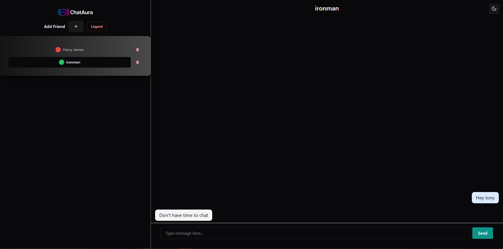
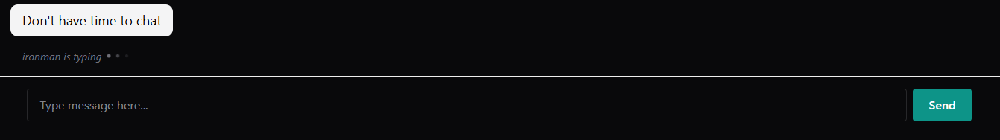

# ChatAura — Realtime Chat App

[](https://github.com/m-aliansari/ChatAura/actions/workflows/ci.yml)
[](https://codecov.io/gh/m-aliansari/ChatAura)

A full-stack, real-time messaging web app where users register, add each other as friends, and exchange direct messages over WebSockets. Includes live presence, typing indicators, and offline web-push notifications so users are alerted to new messages even when the app is closed.

Built as a **Yarn 4 (Berry) workspaces monorepo** with a React frontend, an Express + Socket.io backend, and a shared package that keeps the two in sync.

## Features

- **Real-time direct messaging** between friends over Socket.io, with message persistence and history restored on reconnect.
- **Authentication** — registration and login with bcrypt-hashed passwords and stateless JWTs (3h expiry) that authorize both HTTP requests and the WebSocket handshake.
- **Friends system** — add users by username, with validation against self-adds, non-existent users, and duplicates; friend lists are kept in sync on both sides.
- **Live presence** — friends' online/offline status updates in real time, with a 3-second disconnect grace window so status doesn't flicker on page refresh.
- **Typing indicators** — typing / stop-typing events relayed between participants.
- **Offline push notifications** — Firebase Cloud Messaging web push notifies users of new messages when the app is backgrounded or closed; clicking a notification deep-links into the conversation via a service worker.
- **Rate limiting** — per-IP, Redis-backed limiting on auth endpoints.
- **Light/dark theming** with a responsive Chakra UI interface.

## Screenshots

The full chat interface — friends list with live online (green) / offline (red) presence, and an active conversation:



Live typing indicator:



## Tech Stack

**Frontend** — React 19, Vite, Chakra UI v3 (Emotion + Framer Motion), React Router v7 (hash routing), Formik + Yup, socket.io-client, Firebase JS SDK (FCM)

**Backend** — Node.js, Express 5, Socket.io, `jsonwebtoken`, bcrypt, Helmet + CORS, firebase-admin, pg-promise + node-pg-migrate, redis

**Data** — PostgreSQL (durable: users, FCM tokens) · Redis (realtime/ephemeral: presence, message buffers, FCM token cache, rate-limit counters)

## Monorepo layout

```
packages/
  client/   @realtime-chatapp/client  — React + Vite frontend
  server/   @realtime-chatapp/server  — Express + Socket.io backend
  common/   @realtime-chatapp/common  — shared Yup schemas + constants
```

`common` is imported by **both** client and server and is the single source of truth for socket event names, API route paths, and form validation — change an event/route name there, not in a consumer, to avoid client/server drift.

## Architecture highlights

- **Stateless JWT auth across two transports.** The same token authorizes REST calls (`Authorization: Bearer <token>`) and the Socket.io handshake (`handshake.auth.token`). A socket middleware (`authorizeUser`) verifies the JWT before any event is processed and attaches `socket.user`. No server-side sessions, so no sticky-session requirement.
- **Dual datastore by access pattern.** PostgreSQL holds durable relational data; Redis holds all hot-path realtime state (presence, per-user message buffers, rate limiting). FCM tokens use a read-through cache (Redis first, Postgres fallback, then backfill).
- **Room-based routing.** Each user joins a Socket.io room keyed by their user ID, so messages and friend events reach every tab/device they have open.
- **Disconnect grace period.** A 3-second timer delays marking a user offline; a reconnect within the window cancels it, preventing presence flicker on refresh.
- **End-to-end push pipeline.** Service worker registration → token persistence/caching → server dispatch via firebase-admin → notification-click deep-link back into the conversation.

## Getting started

### Prerequisites

- Node.js + Yarn 4 (Berry) — the repo pins `yarn@4.9.2` via `packageManager`
- A PostgreSQL instance and a Redis instance
- (Optional, for push notifications) a Firebase project + service account

### Install

```bash
yarn install
```

### Configure environment

**`packages/server/.env`**

```
PORT=
JWT_SECRET=
NODE_ENV=development
DATABASE_NAME=
DATABASE_HOST=
DATABASE_USER=
DATABASE_PASSWORD=
DATABASE_PORT=
REDIS_USERNAME=
REDIS_PASSWORD=
REDIS_SOCKET_HOST=
REDIS_SOCKET_PORT=
CLIENT_BASE_URL=
CLIENT_BASE_URL_DEV=
```

> Remote (authenticated) Redis is used only when `NODE_ENV=production`; in development a local Redis is used. For push notifications, place a Firebase `service-account.json` in `packages/server/` (gitignored).

**`packages/client/.env`** (Vite requires the `VITE_` prefix)

```
VITE_API_BASE_URL=
VITE_FIREBASE_VAPID_KEY=
```

### Set up the database

```bash
yarn workspace @realtime-chatapp/server migrate:up
```

### Run in development

```bash
yarn dev:server   # nodemon backend
yarn dev:client   # vite dev server
```

The client uses **hash routing**, so URLs look like `http://localhost:5173/#/...`.

## Scripts

Run from the repo root:

| Command             | Description                        |
| ------------------- | ---------------------------------- |
| `yarn dev:server`   | Start the backend (nodemon)        |
| `yarn dev:client`   | Start the Vite dev server          |
| `yarn build:client` | Production build of the client     |
| `yarn start`        | Run the backend (production entry) |

Per-package:

| Command                                                         | Description                                |
| --------------------------------------------------------------- | ------------------------------------------ |
| `yarn workspace @realtime-chatapp/client lint`                  | ESLint the client                          |
| `yarn workspace @realtime-chatapp/server migrate:up`            | Apply migrations                           |
| `yarn workspace @realtime-chatapp/server migrate:down`          | Roll back the last migration               |
| `yarn workspace @realtime-chatapp/server migrate:redo`          | Roll back then re-apply the last migration |
| `yarn workspace @realtime-chatapp/server migrate:create <name>` | Scaffold a new migration                   |

> There is no automated test suite in this repo.

## License

MIT
